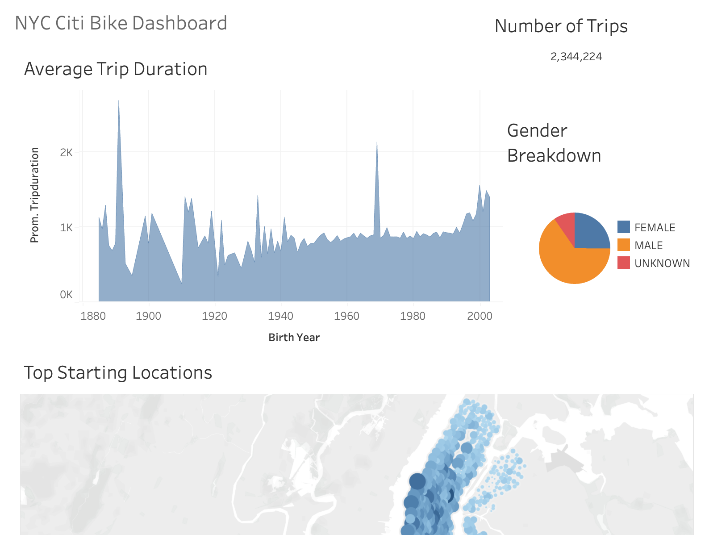
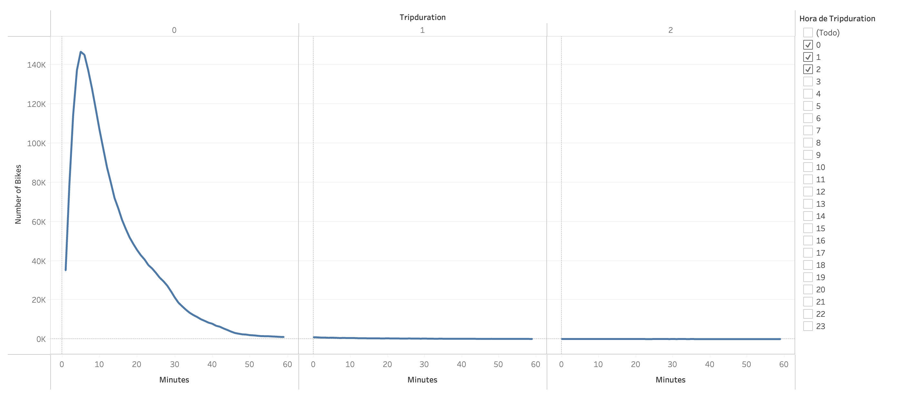
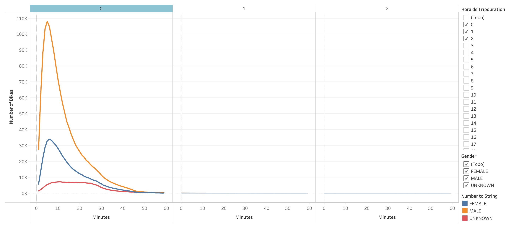
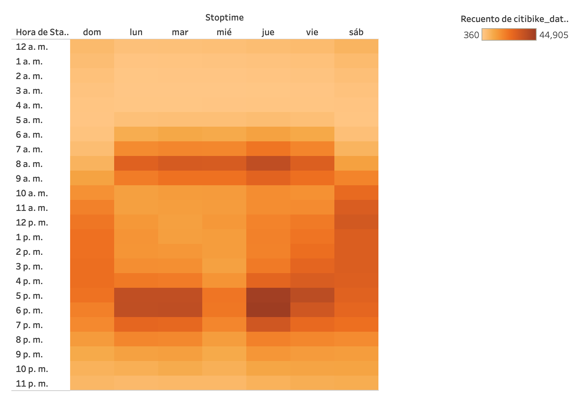
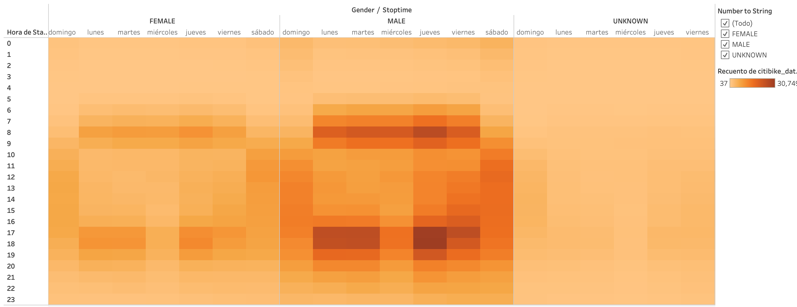
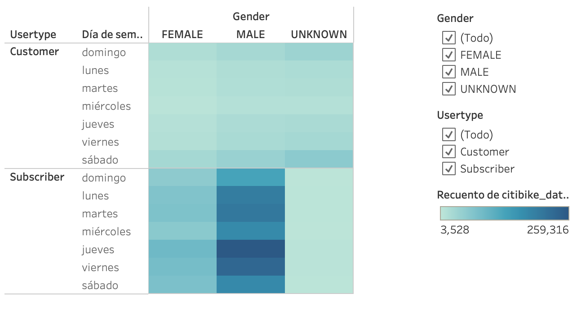

# Bikesharing 

## Overview of the analysis

This project has as objective to analize through Tableau how the bike-sharing model bussiness runs in NYC so a group of investors can decide if this same model could run in Des Moines. Making data visualization helps people with a very busy agenda to make decisions faster.

## Results

### Tableau Analysis & Results 
[Click here to see the entire report](https://public.tableau.com/app/profile/eduardo.huerta/viz/NYCOCT21/FINALSTORY?publish=yes)

* Until now this analysis considers 2,344,224 rides.

* Almost 89% of the trips are less than 20 minutes long.

* Best times to do maintenance to the equipment is between 2 - 5 am everyday.

* Males are more used to ride bikes between 7 - 9 am and 5 - 7 pm on weekdays. 

* More than 75% of the users are subscribers.

## Summary 

In conclusion bike sharing bussinesses have a very high acceptance from the public in metropolitan areas mainly because of the traffic jams, lack of parcking spaces, this means Citi Bike services are used as an alternative to driving and public transport, specifically people use this kind of transportation to reach to their offices or place to work.

If you want to get deeper in this analysis there are some many things you can analize such as:

* Age of users in order to get some kind of programs.
* Analize traffic information.
* Compare data to analize trends all year.
* Analize pick & drop points to get more stations according demand.

